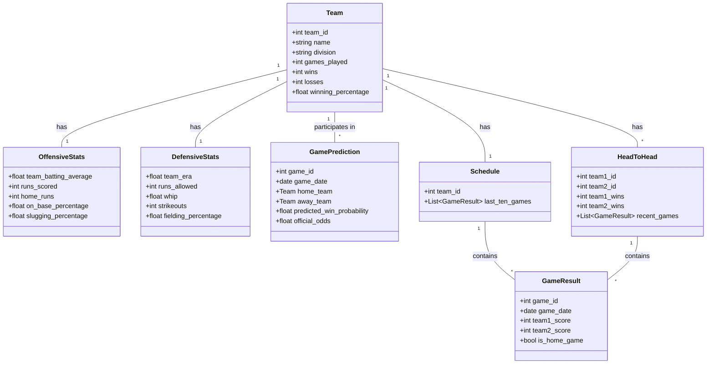

# Model Diagrams

## MLB Current Season Analysis

```mermaid
classDiagram
    class Team {
        +int team_id
        +string name
        +string division
        +int games_played
        +int wins
        +int losses
        +float winning_percentage
    }
    class OffensiveStats {
        +float team_batting_average
        +int runs_scored
        +int home_runs
        +float on_base_percentage
        +float slugging_percentage
    }
    class DefensiveStats {
        +float team_era
        +int runs_allowed
        +float whip
        +int strikeouts
        +float fielding_percentage
    }
    class GamePrediction {
        +int game_id
        +date game_date
        +Team home_team
        +Team away_team
        +float predicted_win_probability
        +float official_odds
    }
    class Schedule {
        +int team_id
        +List~GameResult~ last_ten_games
    }
    class HeadToHead {
        +int team1_id
        +int team2_id
        +int team1_wins
        +int team2_wins
        +List~GameResult~ recent_games
    }
    class GameResult {
        +int game_id
        +date game_date
        +int team1_score
        +int team2_score
        +bool is_home_game
    }
    Team "1" -- "1" OffensiveStats: has
    Team "1" -- "1" DefensiveStats: has
    Team "1" -- "*" GamePrediction: participates in
    Team "1" -- "1" Schedule: has
    Schedule "1" -- "*" GameResult: contains
    Team "1" -- "*" HeadToHead: has
    HeadToHead "1" -- "*" GameResult: contains
```
